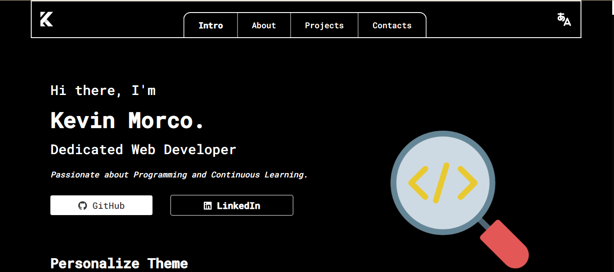

# HeyItsKevin (Customized Portfolio)

This is my first customized portfolio built using ReactJS.

## Tech Stack

**Client:** HTML, CSS, JavaScript, React, TailwindCSS, Web Storage API

## Screenshots

## Acknowledgements

These lists of documentation are what I'm currently using:

- [React](https://react.dev/)
- [MDN Web Docs](https://developer.mozilla.org/)
- [W3Schools](https://www.w3schools.com/)

For video tutorials:

- [@WebDevSimplified](https://www.youtube.com/c/webdevsimplified)
